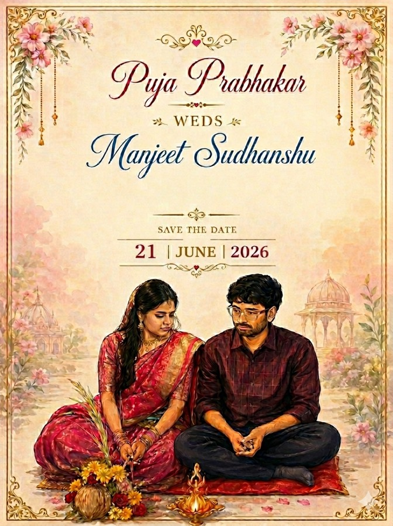
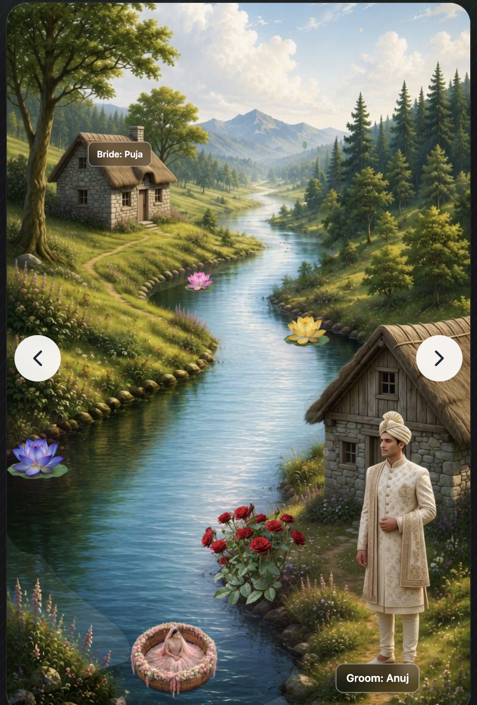

# Puja & Manjeet — Wedding Invitation

An interactive, mobile-first wedding journey: a illustrated river scene, boat milestones, and ceremony details—wrapped in a phone-sized frame with optional ambient music and autoplay tour.

**Live site:** [https://weddinginvitation.sudhanshu-manjeet.workers.dev/](https://weddinginvitation.sudhanshu-manjeet.workers.dev/)

---

## Front card (save-the-date & link previews)

Tap-to-enter splash and social / WhatsApp previews use the same artwork. The JPEG below is the optimized Open Graph asset (`og-image.jpg`, small file size for crawlers).

<p align="center">
  
</p>

Source files: **`index.html`** (splash + meta tags), **`public/og-image.jpg`**, **`public/card.png`** (full-resolution splash).

---

## Interactive scene (React app)

After the splash, guests explore the winding river, lotus milestones, bride & groom markers, and fullscreen ceremony copy. The screenshot is kept as **`public/readme-interactive-scene.png`** (a copy of `Screenshot 2026-05-27 at 8.08.13 PM.png` with an ASCII filename so GitHub and editors resolve the image reliably).

<p align="center">
  
</p>

---

## Highlights

- **Storybook landscape** — Full-bleed forest / valley art, grass base, optional **river** plate with **WebGL water** shader (falls back to static PNG when needed).
- **Journey** — Boat moves along a **spline** path (`boatSplinePath.ts`); milestones open **event modals** and a **fullscreen wedding** screen.
- **Touch & motion** — Lotus and village targets, sky / chevrons for “next”, **wind drift** particles (CSS), subtle **boat** ripple.
- **Pass experience** — Optional **autoplay tour** through milestones until the ceremony card (stops on any real interaction).
- **Audio** — Background track with gesture / splash-dismiss friendly **play** unlocking.
- **Polish** — Grayscale “past event” treatment from dates in config, **reduced motion** respected for wind + river.
- **Hosting** — Static + **Cloudflare Workers** (`npm run deploy`). See **`wrangler`** / Vite plugin in the repo.

---

## Tech stack

| Area | Choice |
|------|--------|
| UI | React 18 + TypeScript |
| Styling | Tailwind CSS v4 |
| Motion | Motion (Framer Motion family) |
| Assets | PNG layers under **`public/layers/`** (see **`layerAssets.ts`**) |
| River | **`RiverWaterShader.tsx`** (WebGL1 fragment shader) |
| Build | Vite 6 + **`@cloudflare/vite-plugin`** |

---

## Quick start

```bash
npm install
npm run dev
```

- **Dev:** [http://localhost:5173](http://localhost:5173) — tap the splash to enter the app.

```bash
npm run build     # production bundle → dist/
npm run deploy    # build + wrangler deploy
```

---

## Customization (where to edit)

| What | Where |
|------|--------|
| Event copy, dates, wedding fullscreen text, leg labels | **`src/app/milestoneConfig.ts`** |
| Asset paths (forest, river, flowers, boat) | **`src/app/layerAssets.ts`** |
| Boat path / legs | **`src/app/boatSplinePath.ts`**, **`Boat.tsx`**, **`App.tsx`** |
| Lotus positions & hit targets | **`src/app/components/LotusFlowers.tsx`** |
| River on/off & blend | **`src/app/App.tsx`** (`SHOW_RIVER_LAYER`), **`RiverPath.tsx`** |
| Splash, **Open Graph**, Twitter cards | **`index.html`** |
| Link preview image (regenerate from `card.png` if art changes) | Regenerate **`public/og-image.jpg`** (see comment in `index.html`) |

More structural notes: **`LAYER_STRUCTURE.md`** (may predate some components; prefer the table above and `src/app/components/` for truth).

---

## Project layout (app)

```
src/app/
├── App.tsx                          # Scene, navigation, autopilot, modals
├── boatSplinePath.ts                # River / boat spline keyframes
├── layerAssets.ts                   # /public/layers URLs
├── milestoneConfig.ts               # All ceremony & milestone copy
└── components/
    ├── GrassBackground.tsx
    ├── ForestBackground.tsx
    ├── RiverPath.tsx                # River plate + shader mount
    ├── RiverWaterShader.tsx         # WebGL water
    ├── WindDrift.tsx
    ├── LotusFlowers.tsx
    ├── Villages.tsx
    ├── Boat.tsx
    ├── EventModal.tsx
    ├── WeddingCeremonyFullscreenModal.tsx
    ├── BackgroundMusic.tsx
    └── MobileInviteShell.tsx
```

---

## License / credits

Private project for the wedding invitation. Art and music are your own to license.

Built with care for guests on phones first—**open the [live link](https://weddinginvitation.sudhanshu-manjeet.workers.dev/), tap through, and enjoy the day.** 💐
